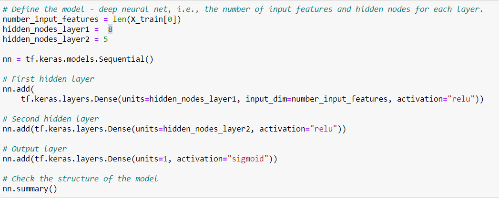

# Neural Network Charity Analysis

## Overview 
Use our knowledge of machine learning and neural networks to create a binary classifier that can predict the likelihood of applicants’ successfulness if funded by Alphabet Soup. A dataset containing over 34,000 organizations that have received funding from Alphabet Soup over the years was used to build the model. 

## Results

### **Data Preprocessing**

**What variable(s) are considered the target(s) for your model?** 

The target variable is the “IS_SUCCESSFUL” column.

**What variable(s) are considered to be the features for your model?** 

•	APPLICATION_TYPE—Alphabet Soup application type.

•	AFFILIATION—Affiliated sector of industry.

•	CLASSIFICATION—Government organization classification.

•	USE_CASE—Use case for funding.

•	ORGANIZATION—Organization type

•	STATUS—Active status.

•	INCOME_AMT—Income classification.

•	SPECIAL_CONSIDERATIONS—Special consideration for application.

•	ASK_AMT—Funding amount requested.

Note: ‘SPECIAL_CONSIDERATIONS’ was dropped and ‘ASK_AMT’ was divided into bins during optimization. 

**What variable(s) are neither targets nor features, and should be removed from the input data?** 

The ‘EIN’ and ‘NAME’ columns were removed from the data since they did not provide any relevant data that would improve the model performance.  ‘EIN’, ‘NAME’, ‘SPECIAL_CONSIDERATIONS’ were removed during optimization.   

### **Compiling, Training, and Evaluating the Model**

**How many neurons, layers, and activation functions did you select for your neural network model, and why?** 

43 neurons were used ; 2 layers- 8 and 5 neurons each; hidden layers=’relu’, output=’sigmoid’. This configuration was used to get an idea of the model performance. During optimization, the number of layers were increased up to 3 along with the number of neurons in each layer. 

**Were you able to achieve the target model performance?**
No, the target model performance of 75% was not achieved.  The highest accuracy achieved was 67%.

**What steps did you take to try and increase model performance?**

•	Removed the SPECIAL_CONSIDERATIONS column

•	Divided the AMT_ASK column into bins

•	The number of neurons in the layers were modified, additional hidden layers were added to the model, and the activation functions were modified. 

## Summary

After several attempts I was unable to create a model that performed at 75% accuracy or higher. Although extra layers were added, the number of neurons increases, and the activation functions being modified, I was still unsuccessful possibly due to noisy variables. 

Some recommendations for improving this model would be to try Leaky ReLU and Tanh functions to attempt to improve the model outcomes or random forest models, which can handle outliers and nonlinear data.  I would also recommend taking a closer look at the data used in the model as this can have the greatest impact on the outcome of the model. 

